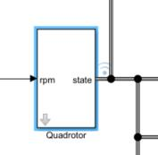

# quadrotor_matlab_sim
quadrotor matlab Simulation templates

Rigid model

the reference frame is the world ned frame

the boby frame also is the ned frame

input value:Torque and thrust （Torque in the boby_ned frame ,thrust > 0）

output state: position;Ang;velocity;Angular velocity.

translational velocity mapped to body frame;
Angular velocity mapped to body frame.
# system
simulink model

# quadtor
quadrotor model is in model/quadrotor_dynamics.m

Initial position,Initial Ang.(Y,P,R) rad is be set up.

quadrotor parameter is be set in model/mdl_quad.m.

# figure
 model/quadrotor_plot.m is used  to  show state.

xy-axes dimension,z-axis dimension  control show scale and the size of blue box.

figure handle control the figure handle value.

enable show figure control whether show the figure.(0:false 1:true) Display teh figure will occupy a lot of cpu,
it is recommended not to display when debugging. 

